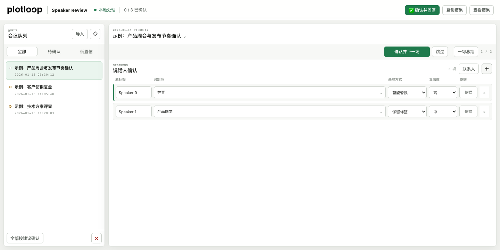

  

<h1 align="center">PlotLoop Speaker Review</h1>

  A local-first workbench for turning uncertain speaker labels into reviewed, reusable meeting data.

  <a href="https://granken.github.io/plotloop-speaker-review/"><strong>在线体验</strong></a>
  ·
  <a href="./docs/DATA_FORMAT.md">数据协议</a>
  ·
  <a href="./PRIVACY.md">隐私说明</a>

一个用于会议文字稿说话人校对的本地网页工具。把模型给出的 \`Speaker 0\`、\`讲话人 1\` 等候选标签集中导入，快速确认、修改并导出统一的 \`speaker-review v2\` JSON。

## 为什么做

说话人识别通常不是一次推理就结束，而是一个闭环：

1. 模型根据上下文提出候选人和置信度。
2. 熟悉参会人的用户快速确认或纠正。
3. 确认结果写回转写、总结和人物记忆。
4. 新的确认继续提高下一轮识别质量。

PlotLoop Speaker Review 负责第 2 步，并把第 3、4 步需要的结构化结果交出去。

## 特点

- **快审**：会议队列与宽校对区组成主界面；支持“确认并下一场”和整批按建议确认。
- **自动联动**：把候选人改成另一个名字时，处理方式自动设为 \`replace\`，置信度自动设为 \`high\`。
- **时间到秒**：同时展示日期和时分秒，便于区分同一天的多场会议。
- **点选联系人**：点击姓名字段直接打开“最近使用 + 常用联系人”选择层，手机远程操作不依赖键盘输入。
- **紧凑判断区**：每个说话人默认只占一行，判断依据和删除操作按需展开。
- **信息按需出现**：切换会议时短暂展示一句话总结；会议信息收在标题中，JSON 结果默认收进抽屉。
- **就近连续确认**：主操作紧贴会议标题和一句总结，固定按“确认并下一场、跳过”的顺序呈现，手机远程操作也无需把光标移到页面角落。
- **低置信筛选**：一键只看仍需人工判断的会议。
- **本地优先**：没有后端、账号、埋点或网络请求；数据只保存在当前浏览器。
- **直接打开**：无需安装依赖，双击 \`index.html\` 即可使用。

## 快速开始

直接打开 [在线体验版](https://granken.github.io/plotloop-speaker-review/) 即可使用完全虚构的示例数据，无需安装。

需要在本机使用私人联系人和待确认数据时，可以直接打开 [index.html](./index.html)。

也可以启动本地静态服务：

\`\`\`bash
npm run serve
\`\`\`

然后访问 \`http://localhost:4173\`。

运行核心逻辑测试：

\`\`\`bash
npm test
\`\`\`

## 使用流程

1. 点击“导入”，粘贴或选择 \`speaker-review\` JSON。
2. 浏览会议的一句话特别总结、时间和候选映射。
3. 确认建议，或点击姓名从常用联系人中选择正确的人。
4. 点击“确认并下一场”。
5. 复制或下载右侧 JSON，交给后续 Agent 写回文字稿与总结。

完整格式见 [数据协议](./docs/DATA_FORMAT.md)，可直接使用 [脱敏示例](./examples/demo-speaker-review.json) 测试。

## 项目边界

本项目不负责：

- 音频转写；
- 声纹注册或声纹比对；
- 自动修改原始文字稿；
- 把会议数据上传到云端；
- 替代人工处理低置信、多说话人串并等复杂情况。

这些能力可以作为独立适配器接入，但不应破坏本地校对工具的简单性。

## 技术结构

\`\`\`text
index.html          页面结构
src/styles.css      三栏工作台与移动端视图
src/core.js         数据解析、决策联动和导出协议
src/bootstrap.js    本机私人数据与公开演示数据的加载边界
src/app.js          浏览器状态、交互与本地存储
src/demo-data.js    虚构演示数据
tests/              无依赖核心测试
\`\`\`

项目使用原生 HTML、CSS 和 JavaScript，不需要构建步骤或第三方运行时依赖。

## 隐私

会议标题、人名和判断依据都可能是敏感信息。公开提交前请阅读 [PRIVACY.md](./PRIVACY.md)。本仓库只包含虚构样例，不包含真实花名册、会议记录、本机路径或历史校对结果。

## 项目信息

产品定位、命名理由、范围和路线图见 [PROJECT_BRIEF.md](./docs/PROJECT_BRIEF.md)。

## License

MIT
